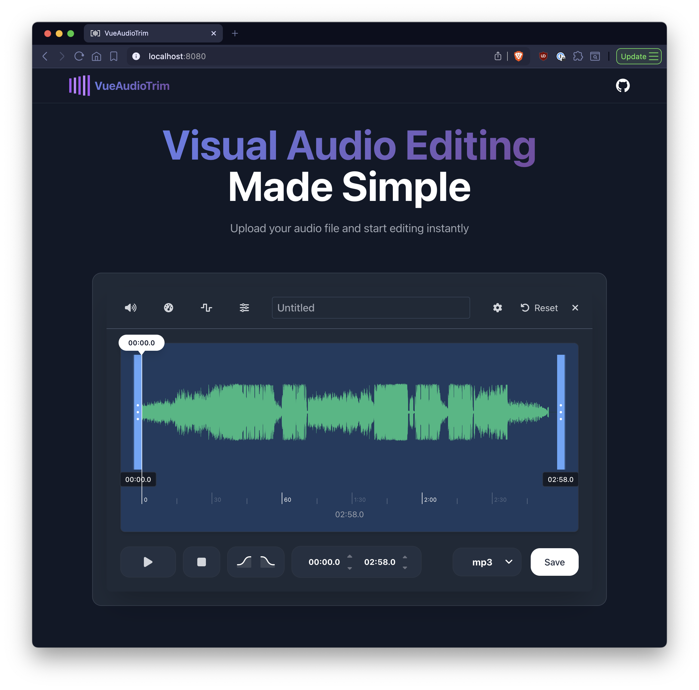

# VueAudioTrim

A modern, lightweight Vue.js audio editor built with TypeScript and WaveSurfer.js. VueAudioTrim provides an intuitive interface for precise audio trimming, real-time fade effects, volume control, and multi-format export - all running entirely in the browser.




## ✨ Features

- 🎵 **Precision Audio Trimming** - Cut and trim audio with millisecond accuracy using visual waveform editing
- 🔄 **Real-time Fade Effects** - Apply smooth fade in/out with customizable durations (0.5-10 seconds)
- 🎚️ **Live Audio Effects** - Volume control, speed adjustment, and 10-band equalizer with real-time preview
- 📊 **Interactive Waveform** - Visual audio representation with draggable region selection
- 🎛️ **BPM Detection & Tempo Control** - Automatic BPM detection with pitch-preserving tempo adjustment
- 💾 **Multi-format Export** - Export to MP3 with customizable bitrate settings
- ⌨️ **Keyboard Shortcuts** - Space for play/pause, arrow keys for navigation
- 🌙 **Modern Dark UI** - Sleek interface optimized for long editing sessions
- 📱 **Fully Responsive** - Works seamlessly across desktop, tablet, and mobile devices
- 🚀 **Browser-based** - No installation required, runs entirely in your browser

## 🚀 Quick Start

### Prerequisites

- Node.js 16+
- npm or yarn

### Installation

```bash
# Clone the repository
git clone https://github.com/tony-nz/vue-audio-trim.git
cd vue-audio-trim

# Install dependencies
npm install

# Start development server
npm run dev
```

### Building for Production

```bash
# Build for production
npm run build

# Preview production build
npm run preview
```

## 🏗️ Tech Stack

**Frontend Framework**
- Vue 3 with Composition API & TypeScript
- Vite for fast development and building

**Audio Processing**
- WaveSurfer.js for waveform visualization and playback
- lamejs for MP3 encoding
- music-tempo for BPM detection

**Styling & UI**
- Tailwind CSS for responsive design
- Font Awesome for icons
- Custom dark theme optimized for audio editing

## 🎛️ How to Use

### Quick Start Guide

1. **📁 Upload Audio** - Click "Upload Audio File" and select your audio file (MP3, WAV, etc.)
2. **✂️ Select Region** - Drag the blue handles on the waveform to choose what to keep
3. **🎚️ Adjust Effects** - Use the toolbar buttons to modify volume, speed, or equalizer
4. **🔄 Add Fades** - Enable fade in/out and customize durations via the Fade Settings (⚙️) button
5. **💾 Export** - Click "Save" to download your edited audio as MP3

### Keyboard Shortcuts

- `Space` - Play/Pause audio
- `←/→` - Navigate through the timeline
- `Esc` - Reset all effects and settings

### Pro Tips

- **Fade Settings**: Click the ⚙️ button in the header to customize fade durations from 0.5 to 10 seconds
- **Precision Editing**: Use the time inputs for exact start/end times down to milliseconds
- **Real-time Preview**: All effects are applied in real-time during playback
- **BPM Adjustment**: Click the Speed button to auto-detect BPM and adjust tempo without pitch changes

## 🛠️ Development

Built with Vue 3 Composition API and TypeScript using a modular composables architecture. The codebase is organized into reusable components and composables that handle specific audio editing functionality.

### Key Architecture Decisions

- **Composables Pattern**: Business logic separated into reusable composables (`useWaveSurfer`, `useAudioEffects`, etc.)
- **Real-time Processing**: All effects are applied during playback for immediate feedback
- **Browser-first**: Designed to run entirely in the browser without server dependencies

## 🤝 Contributing

1. Fork the repository
2. Create a feature branch: `git checkout -b feature/amazing-feature`
3. Commit changes: `git commit -m 'Add amazing feature'`
4. Push to branch: `git push origin feature/amazing-feature`
5. Open a Pull Request

### Development Guidelines

- Follow the existing code style and patterns
- Add TypeScript types for all new code
- Write unit tests for new features
- Update documentation for significant changes

## 📄 License

This project is licensed under the MIT License - see the [LICENSE](LICENSE) file for details.

## 🙏 Acknowledgments

- [WaveSurfer.js](https://wavesurfer.xyz/) - Excellent audio visualization library
- [Vue.js](https://vuejs.org/) - The progressive JavaScript framework
- [Tailwind CSS](https://tailwindcss.com/) - Utility-first CSS framework
- [Vite](https://vitejs.dev/) - Next generation frontend tooling

---

**Made with ❤️ using Vue 3, TypeScript, and WaveSurfer.js**
